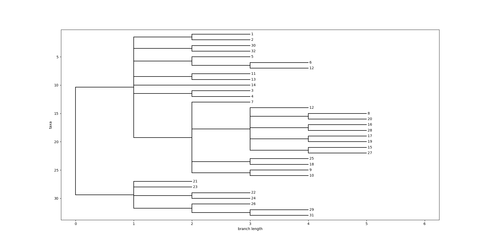

# Beetle Cladogram Generator

Script developed for a Systematics course assignment. The goal was to build a cladogram from morphological data collected from 32 beetle specimens, grouping them by shared derived characters (synapomorphies).

## What it does

Reads a Newick-format string encoding the phylogenetic relationships between specimens and generates a cladogram using BioPython's `Phylo` module and Matplotlib. The output is saved as a PNG file.

## Output



## Requirements

```
biopython
matplotlib
```

## Usage

```bash
python3 Clado.py
```

The cladogram will be saved as `Clado_besouros.png` in the working directory.

## Notes

- Specimen labels are numeric identifiers (1–32) corresponding to individual beetles analyzed in the assignment
- The Newick string encodes groupings based on morphological character matrix built during the practical class
